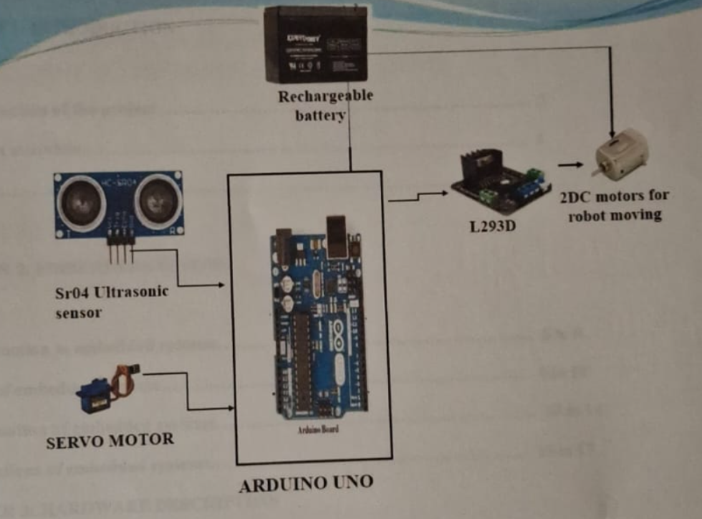
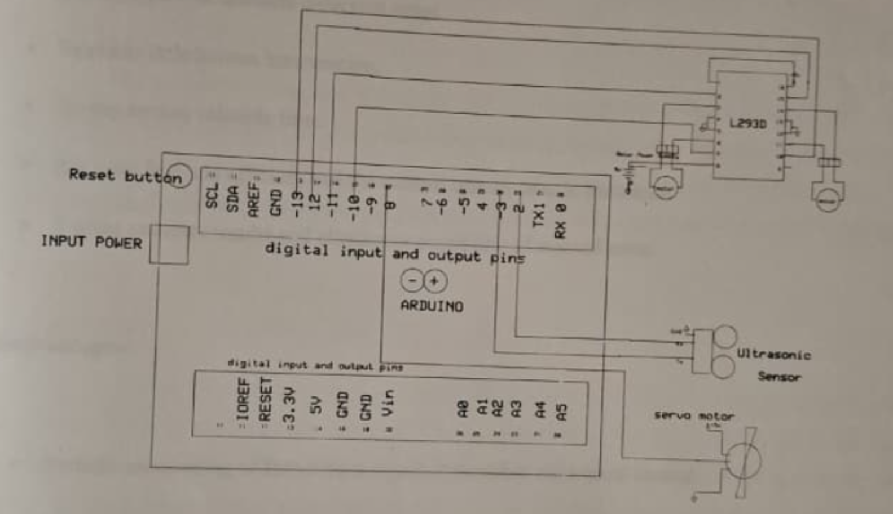
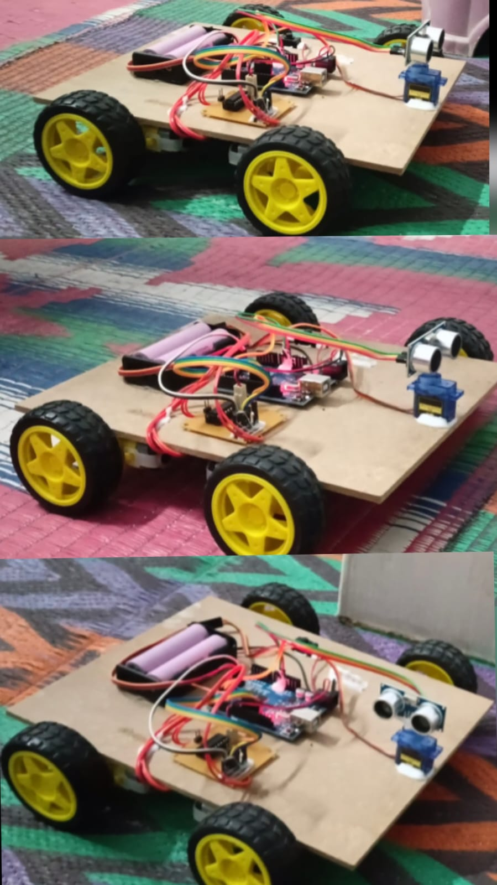

# Obstacle Detection and Avoiding Robot Car Using Arduino UNO

> 🏆 **State-Level 2nd Prize – Telangana Srujana Techfest (2023–2024)**
>
> This project was awarded **2nd Prize** at the Telangana State Srujana Techfest (2023–2024) for its practical implementation of an autonomous obstacle detection and avoidance robot using Arduino UNO.

---

## Project Overview

This project was developed during my Diploma in Electrical and Electronics Engineering to understand the fundamentals of embedded systems, robotics, and sensor interfacing.

The robot is designed to move autonomously by continuously detecting obstacles using an HC-SR04 ultrasonic sensor. Whenever an obstacle is detected within a predefined distance, the Arduino UNO processes the sensor data and changes the direction of the robot, allowing it to continue moving without manual control.

The project provided hands-on experience in hardware integration, embedded programming, motor control, and robotic automation.

---

## Project Specifications

| Item | Details |
|------|---------|
| Microcontroller | Arduino UNO |
| Programming Language | Embedded C (Arduino IDE) |
| Sensor | HC-SR04 Ultrasonic Sensor |
| Motor Driver | L293D |
| Navigation | Autonomous Obstacle Avoidance |
| Power Source | Rechargeable Battery |
| Project Type | Embedded Systems & Robotics |

---

## Features

- Autonomous obstacle detection
- Automatic obstacle avoidance
- Real-time ultrasonic distance measurement
- Servo motor based environmental scanning
- Battery-powered operation
- Low-cost robotic automation
- Embedded C based control system

---

## Bill of Materials

| Component | Quantity |
|-----------|---------:|
| Arduino UNO | 1 |
| HC-SR04 Ultrasonic Sensor | 1 |
| Servo Motor | 1 |
| L293D Motor Driver | 1 |
| DC Motors | 2 |
| Robot Chassis | 1 |
| Wheels | 2 |
| Rechargeable Battery | 1 |
| Power Switch | 1 |

---

## Software Used

- Arduino IDE
- Embedded C
- ExpressSCH (Circuit Design)

---

## Working Principle

The ultrasonic sensor continuously measures the distance between the robot and nearby obstacles.

The sensor is mounted on a servo motor, allowing it to scan different directions. Whenever an obstacle is detected, the Arduino UNO processes the sensor data and determines the safest direction to move.

The Arduino then controls the L293D motor driver, which drives the DC motors accordingly. This process repeats continuously, enabling the robot to navigate autonomously without human intervention.

---

## Project Gallery

### Block Diagram

---

### Circuit Diagram

---

## Robot Prototype

The image below shows the final prototype of the obstacle detection and avoiding robot developed using Arduino UNO, an HC-SR04 ultrasonic sensor, a servo motor, and an L293D motor driver. The robot was built to autonomously detect obstacles and navigate around them without human intervention.

---

## Working Demonstration

A short demonstration of the robot is available in the video below. The demonstration shows the robot detecting nearby obstacles, changing its direction automatically, and continuing along an obstacle-free path.

🎥 **Project Demonstration Video:**

Robot_Demonstration.mp4

---

## Applications

This project can be used in:

- Autonomous Mobile Robots
- Warehouse Automation
- Industrial Material Handling
- Educational Robotics
- Smart Navigation Systems
- Embedded Systems Learning

---

## What I Learned

Working on this project helped me understand:

- Arduino Programming
- Embedded C Programming
- Sensor Interfacing
- Motor Driver Control
- Servo Motor Control
- Embedded Systems
- Robotics Fundamentals
- Hardware Integration
- Circuit Design
- Troubleshooting and Testing

---

## Challenges Faced

Some of the challenges I encountered during this project were:

- Calibrating the ultrasonic sensor for reliable distance measurement.
- Ensuring smooth movement while changing direction.
- Managing wiring connections between sensors, motors, and the controller.
- Testing and troubleshooting the robot under different operating conditions.

These challenges improved my debugging and problem-solving skills during hardware development.

---

## Future Improvements

Some possible enhancements include:

- Bluetooth-based Manual Control
- Mobile App Integration
- Wi-Fi / IoT Connectivity
- Camera-based Navigation
- AI-based Object Detection
- GPS Navigation
- Voice Control

---

## Author

**Mohammed Hameed**

Electrical and Electronics Engineering Student

### Areas of Interest

- Electric Vehicles
- Embedded Systems
- Robotics
- MATLAB / Simulink
- Power Electronics

---

## Acknowledgement

I would like to express my sincere gratitude to my project guide, faculty members, and Government Polytechnic Chegunta for their guidance and support throughout this project.

I am also thankful to the Telangana State Srujana Techfest (2023–2024) for providing an opportunity to present this work, where it was awarded **State-Level 2nd Prize**.

---
